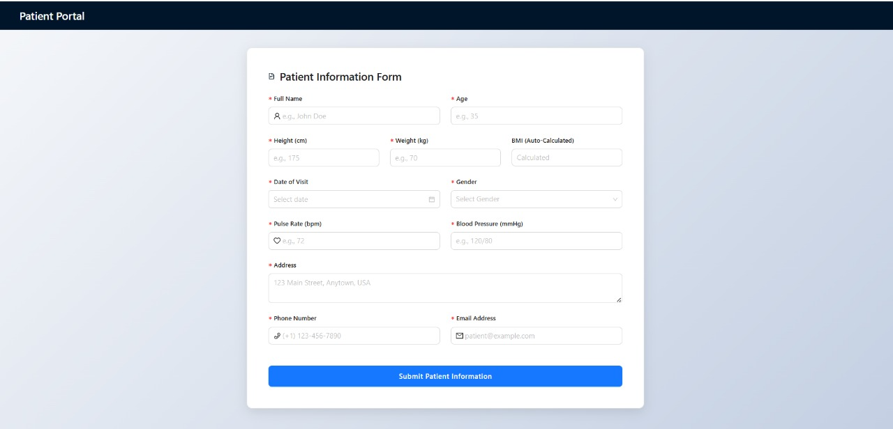

# Patient Information Form (Vite + React + Ant Design)

A responsive and feature-rich patient information form built with a modern frontend stack. This application provides a clean, professional interface for capturing essential patient data, featuring real-time calculations and a user-friendly design.

### ✨ [View the Live Demo Here](https://prachi-prashar.github.io/patient-information-form/) ✨

---

## 📸 Project Screenshot



*(**Note to developer:** To make this screenshot appear, take a picture of your application running, save it as `screenshot.png`, and place it inside the `/public` folder of your project.)*

---

## 🚀 Core Features

-   **Comprehensive Data Fields:** Captures all required patient details:
    -   Personal Info: Name, Age, Gender
    -   Physical Measurements: Height (cm), Weight (kg)
    -   Vitals: Date, Pulse Rate (PR), Blood Pressure (BP)
    -   Contact Info: Address, Phone Number, Email
-   **Automatic BMI Calculation:** The Body Mass Index (BMI) is calculated and displayed in a read-only field the moment both `Height` and `Weight` are entered.
    -   *Formula Used:* `BMI = Weight (kg) / (Height (m))^2`
-   **Interactive UI:** Built with the high-quality [Ant Design](https://ant.design/) component library for a polished and accessible user experience.
-   **Responsive Design:** The form layout is fully responsive, ensuring a seamless experience on desktops, tablets, and mobile devices.
-   **User-Friendly Feedback:** Provides clear success messages upon submission and highlights validation errors to guide the user.
-   **Console Logging:** On successful submission, all captured form data is logged to the browser console for debugging and verification.

---

## 🛠️ Technology Stack

-   **Build Tool:** [Vite](https://vitejs.dev/) - For a blazing fast development experience.
-   **Frontend Library:** [React](https://reactjs.org/) - For building the user interface.
-   **UI Framework:** [Ant Design](https://ant.design/) - For its comprehensive and professional set of UI components.
-   **Deployment:** [GitHub Pages](https://pages.github.com/) - For hosting the live demo.

---

## ⚙️ How to Run Locally

To get a local copy up and running, follow these simple steps.

### Prerequisites

-   Node.js (v16 or higher)
-   npm (or yarn/pnpm)

### Installation

1.  **Clone the repository:**
    ```bash
    git clone https://github.com/prachi-prashar/patient-information-form.git
    ```

2.  **Navigate into the project directory:**
    ```bash
    cd patient-information-form
    ```

3.  **Install the necessary dependencies:**
    ```bash
    npm install
    ```

4.  **Start the development server:**
    ```bash
    npm run dev
    ```

The application will now be running on `http://localhost:5173`.

---

## 📜 Available Scripts

This project comes with the following scripts:

-   `npm run dev`: Starts the development server.
-   `npm run build`: Bundles the application for production into the `dist` folder.
-   `npm run deploy`: A custom script that builds the application and deploys it to GitHub Pages.
-   `npm run preview`: Serves the production build locally to test it before deployment.
